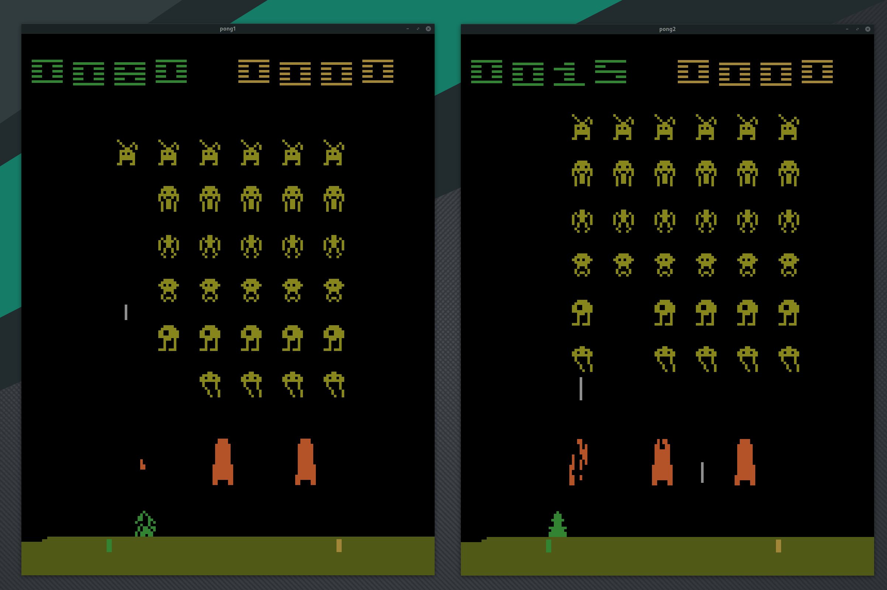

# Gym

A collection of RL envs and interfaces.
- Does not bind to Python like other RL crates. You can run faster and parallel computations.
- Provides an unified interface to various envs. Verify your algorithm on classic envs and apply to your domain without code change.

Example of running envs in separate threads without vectorized envs:


Crates          | Role
----------------|----------------------------------------------------------------
`gym`           | main crate including all sub-crates
`gym-core`      | provides `GymEnv`, `ContinuousEnv`, `DiscreteEnv`, etc
`atari-env`     | atari specific interface such as `render_rgb24` or `render_ram`
`openspiel-env` |

## Example
```
cargo run --example pong
cargo run --example pongpong
cargo run --example gym (requires the environmental variable `ATARI_ROMS_DIR`)
cargo run --example ppo (WIP)
```

## Feature gates

Crates          | Default | Available
----------------|---------|------------
`gym`           | `atari` | `openspiel`
`gym-core`      |         |
`atari-env`     |         | `sdl`
`atari-env-sys` |         |
`openspiel-env` |         |

Example: `gym = {version = "*", features = ["atari", "openspiel", "atari_env/sdl"]} `

## ROMs
The easiest way to obtain ALE-compatible ROMs is `pip install atari-py`.
You will have ROM files in `~/.local/lib/python3.x/site-packages/atari_py/atari_roms/`.

## License
Crates          | License
----------------|--------
`gym`           | MIT
`gym-core`      | MIT
`atari-env`     | GPL v2
`atari-env-sys` | GPL v2
`openspiel-env` | ?
